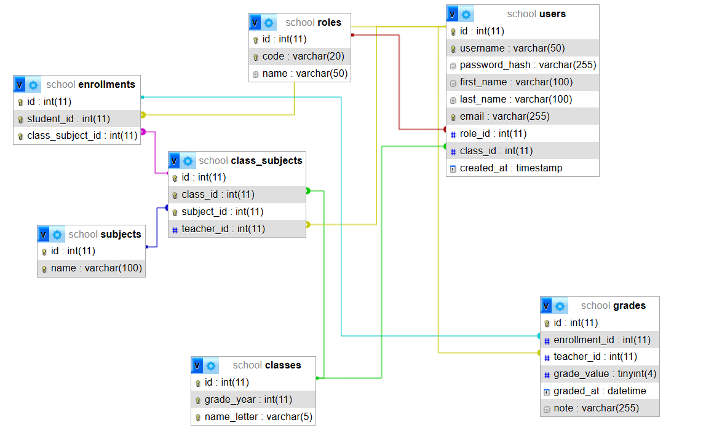

# Žiacka knižka – webová aplikácia

Webová aplikácia na evidenciu známok žiakov základnej školy.  
Projekt je vytvorený ako záverečné zadanie.

---

## Použité technológie

- Node.js
- Express
- MariaDB
- Docker & Docker Compose
- Nunjucks
- Bootstrap
- phpMyAdmin

---

## Spustenie projektu

### Požiadavky

- nainštalovaný Docker
- nainštalovaný Docker Compose

---

### Spustenie aplikácie

```bash
docker compose up --build
```
Po spustení je aplikácia dostupná na:

http://localhost:3000 – webová aplikácia

http://localhost:8080 – phpMyAdmin

---

## Testovacie účty

Všetky testovacie účty používajú rovnaké heslo:
password

**Administrátor**
username: admin

**Učitelia**
username: t01, t02, ..., t12

**Žiaci**
username: s1a01, s1a02, ...

---

## Používateľské roly
Administrátor
- prehľad používateľov systému

- správa aplikácie

Učiteľ
- vidí svoje predmety v triedach

- môže zadávať známky žiakom

Žiak
- vidí svoje predmety a pridelené známky

## Databáza
Databáza sa inicializuje automaticky pri prvom spustení MariaDB kontajnera.

Testovacie dáta sú generované deterministicky priamo v SQL skripte:

- triedy

- používatelia (administrátor, učitelia, žiaci)

- predmety

- zápisy žiakov na predmety

- Inicializačný SQL súbor

- docker/build/mariadb/init_school.sql

## Databázový model
Diagram databázových tabuliek je vytvorený pomocou phpMyAdmin
a je priložený ako obrázok.



docs/school_DB.png

## Poznámka k vývoju
Pri zmene SQL inicializačného skriptu je potrebné zmazať databázové dáta:

```bash
docker compose down
rm -rf docker/data/mariadb
docker compose up --build

